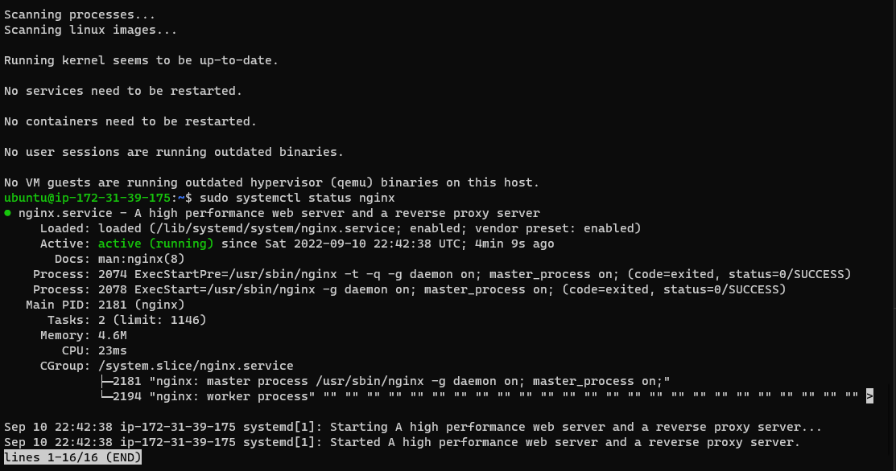
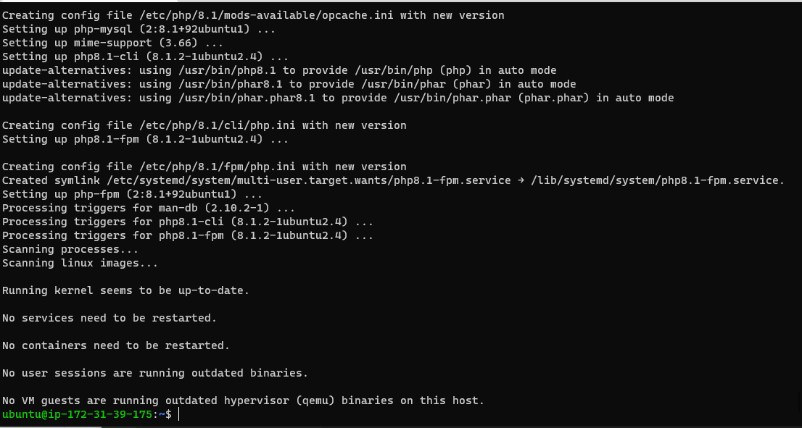

**STEP 1 – INSTALLING THE NGINX WEB SERVER**

- `verify that nginx was successfully installed and is running as a service in Ubuntu`

- `Test how our Nginx server can respond to requests from the Internet.`

---

**STEP 2 — INSTALLING MYSQL**

- `Mysql Secure Installtion ,Interactive Script`

---

**STEP 3 – INSTALLING PHP**

- Install php-fpm and php-mysql

---
**STEP 4 — CONFIGURING NGINX TO USE PHP PROCESSOR**

- `Test your configuration for syntax errors`

- `Create an index.html file in that location so that we can test that our new server block works as expected`

---

**STEP 5 – TESTING PHP WITH NGINX**

- `We test it to validate that Nginx can correctly hand .php files off our PHP processor.`

	

---

**STEP 6 – RETRIEVING DATA FROM MYSQL DATABASE WITH PHP**

- `Create new database & new user and grant it full priviledges on the database we just created`

- `Confirm the example_user have access to example_database`

- `We create a test table named todo_list. From the MySQL console`

- `Create a PHP script that will connect to MySQL and query for our content`

